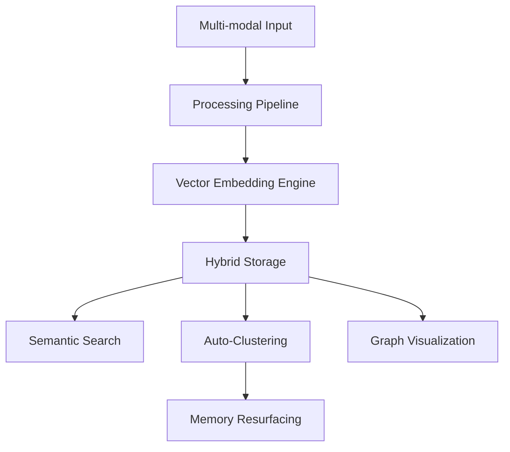

# 🧠 Second Brain: AI-Automated Knowledge System Roadmap

A comprehensive architectural guide and execution plan to transform a simple media archiver into a fully autonomous, self-organizing knowledge engine.

---

## 1. Project Overview
The "Second Brain" is an intelligent repository that ingests multi-modal content (Articles, Tweets, PDFs, Images, Videos). It moves beyond manual folder structures by using **Semantic Search**, **Automatic Clustering**, and **Graph Visualization** to link fragmented ideas into a unified knowledge web.

---

## 2. Current vs. Expected Analysis

| Feature | Current State | Target (Top 5% System) | Gap |
| :--- | :--- | :--- | :--- |
| **Ingestion** | Links, PDFs, Images | Browser Extension + YouTube + Twitter Scraper | High |
| **Search** | Keyword-based (Regex) | **Vector-based Semantic Search** | Critical |
| **Organization** | Basic AI Tags | **Topic Clustering & Auto-Collections** | High |
| **Relationship** | None (Isolated items) | **Knowledge Graph (D3.js)** | High |
| **Retention** | Static Dashboard | **Proactive Memory Resurfacing** | Medium |
| **Storage** | MongoDB | **MongoDB + Pinecone (Hybrid)** | Critical |

---

## 3. Architecture Flow



1.  **Ingestion**: Scrapes URL or receives file buffer.
2.  **Processing**: Extracts text via OCR (Tesseract) or Scraping (Puppeteer).
3.  **Embedding**: Converts text into mathematical vectors (OpenAI/Mistral).
4.  **Storage**: Metadata goes to MongoDB; Vectors go to Pinecone.
5.  **Intelligence**: Runs similarity math for search, clusters, and graph relations.

---

## 4. Step-by-Step Execution Plan

### Module 1: Content Ingestion Improvements
*   **What to build**: Dedicated scrapers for YouTube transcripts and Twitter thread extraction.
*   **Flow**: URL → Puppetter/Service → Text + Metadata → Pipeline.
*   **Libraries**: `puppeteer` (General), `youtube-transcript` (YT), `twitter-api-v2`.

### Module 2: Processing Pipeline
*   **What to build**: A Recursive Text Splitter to handle long PDFs and Articles.
*   **Flow**: Extracted Text → Chunking (500 chars) → Embedding → Vector DB.
*   **Libraries**: `langchain`, `@langchain/text-splitters`, `@langchain/mistralai`.

### Module 3: Storage (Hybrid Strategy)
*   **What to build**: Sync layer between MongoDB and Pinecone.
*   **Schema (MongoDB)**:
    ```javascript
    {
      userId: String,
      contentId: ObjectId, // Relates to Pinecone Vector ID
      vectorReady: Boolean,
      summary: String,
      clusterId: String
    }
    ```
*   **Libraries**: `@pinecone-database/pinecone`, `mongoose`.

### Module 4: Semantic Search
*   **What to build**: A search endpoint that converts the query into a vector and finds nearest "neighbors" in Pinecone.
*   **Flow**: User Query → Embedding Model → Pinecone Query → Content Metadata.
*   **Logic**:
    ```javascript
    const vector = await embedder.embed(query);
    const results = await pineconeIndex.query({ vector, topK: 5 });
    ```

### Module 5: AI Tagging (Upgrades)
*   **What to build**: Hierarchical tagging (Category > Sub-category).
*   **Structure**: AI shouldn't just guess keywords; it should map to a predefined "Knowledge Taxonomy."
*   **Libraries**: LangChain `StructuredOutputParser`.

### Module 6: Topic Clustering
*   **What to build**: A service that groups similar items into "automated collections."
*   **Logic**: Use **Cosine Similarity** to find vectors with high overlap.
*   **Libraries**: `ml-kmeans` (for hard clusters) or `similarity` (for simple grouping).

### Module 7: Knowledge Graph
*   **What to build**: A force-directed graph showing items as nodes and shared tags/clusters as edges.
*   **Relation Logic**: If `similarity(itemA, itemB) > 0.85`, create an edge.
*   **Libraries**: `d3.js` or `react-force-graph` (Frontend).

### Module 8: Resurfacing System
*   **What to build**: "Spaced Repetition" engine that highlights old content.
*   **Scoring Logic**: `(CurrentDate - SaveDate) * RandomFactor`.
*   **Execution**: Cron job runs daily at 9 AM to pick 3 items.
*   **Libraries**: `node-cron`.

### Module 9: Extraction Improvements
*   **YouTube**: `ytdl-core` for metadata, `youtube-transcript` for content.
*   **Articles**: `cheerio` + `mozilla/readability` for clean text.
*   **Tweets**: `twitter-api-v2` for thread reconstruction.

---

## 5. Final System Flow
1.  **User saves** a link via a browser extension/UI.
2.  **Backend** scrapes the site and uses **OCR** for any images found.
3.  **LangChain** splits the text into meaningful chunks.
4.  **Mistral AI** generates embeddings and a 1-sentence summary.
5.  **Pinecone** stores the vectors; **MongoDB** stores the metadata.
6.  **Graph Engine** calculates connections to existing saved items.
7.  **Dashboard** instantly updates with tags, categories, and "Related Items" suggestions.

---

## 6. Execution Order (Priority List)
1.  **Vector DB Integration**: Replace Regex search with Semantic search. (Highest Value)
2.  **Advanced Scrapers**: YouTube and Articles transcript support.
3.  **Graph API**: Endpoint to return Node/Edge data for the UI.
4.  **D3 Visualization**: Frontend component for the Knowledge Graph.
5.  **Auto-Clustering**: Background worker to group items.
6.  **Resurfacing Engine**: Daily memory notifications.

---

## 7. Final Result
The system becomes a **Proactive Thought Partner**. Instead of a list of dead links, the user has a visual, searchable web of knowledge that tells them: *"You saved this idea 3 months ago; it's related to the PDF you just uploaded."*
