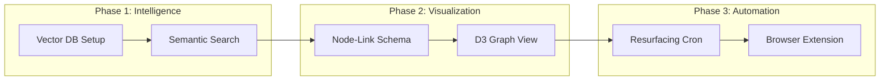

# 🚀 Second Brain: Project Status & Feature Roadmap

This document provides a "Top 5%" analysis of your project's current state versus the ultimate vision of an AI-powered automated knowledge system.

---

## 📊 Current State vs. Vision Matrix

| Feature Category | Original Vision | Current Implementation | Status |
| :--- | :--- | :--- | :--- |
| **Content Input** | Browser Ext, Articles, Tweets, PDF, Image, YT | Link Saving, PDF/Image Uploads | **70% Done** |
| **Storage** | Object Storage + Vector DB | ImageKit + MongoDB | **60% Done** |
| **Brain / Logic** | Semantic Search, Topic Clustering, Graph | Keyword-based Search & AI Tagging | **30% Done** |
| **Organization** | Automatic Knowledge Graph | Manual Tags + AI Suggestion | **40% Done** |
| **Resurfacing** | "2 months ago you saved this" | Chronological Dashboard | **10% Done** |

---

## 🧠 What We Have Built (Current Strengths)

1.  **Multi-Modal Pipeline**: You can now ingest URLs, PDFs, and Images.
2.  **OCR System**: Tesseract-powered image reading is already live.
3.  **AI Tagging**: LangChain + Mistral are actively suggesting tags based on content.
4.  **Premium UI**: A glassmorphic "Knowledge Canvas" that feels high-end.
5.  **Proxy Layer**: Bypasses CORS/Hotlink protection for LinkedIn/Twitter previews.

---

## 🚧 The "Missing" Pieces (Your Roadmap)

To reach the "Top 5%" project status you envisioned, we need to implement these high-complexity modules:

### 1. Semantic Search (Vector Brain)
*   **The Gap**: Currently, search only finds words in the title.
*   **The Fix**: Integrate **Pinecone** or **ChromaDB**.
*   **Why**: You should be able to search for *"marketing ideas"* and find a PDF that doesn't say "marketing" but discusses "customer acquisition."

### 2. Knowledge Graph Visualization
*   **The Gap**: No visual relation between items.
*   **The Fix**: Implement **D3.js** or **React Flow** to show how a Tweet relates to a YouTube video via shared tags/topics.
*   **Goal**: A "Mind Map" view where users see clusters of their knowledge.

### 3. Automatic Topic Clustering
*   **The Gap**: Items are just a list.
*   **The Fix**: A background worker that groups content into "Collections" based on AI-detected themes (e.g., "Web Dev," "Health," "Finance").

### 4. Memory Resurfacing (The "Aha!" Moment)
*   **The Gap**: Old content gets buried.
*   **The Fix**: A "Spaced Repetition" algorithm or a "On This Day" feature.
*   **Feature**: A weekly email or notification: *"Hey, you saved this idea 1 month ago. Does it still resonate?"*

### 5. Browser Extension
*   **The Gap**: User has to manually copy-paste URLs.
*   *Requirement*: A Chrome/Firefox extension to save any page with 1-click.

---

## 🛤️ Implementation Roadmap (Next Steps)

---

## 🛠️ Updated Tech Stack Goals

| Layer | Technology | Status |
| :--- | :--- | :--- |
| **Frontend** | React + Tailwind + Lucide | ✅ Active |
| **Viz** | D3.js / React-Force-Graph | ⏳ Pending |
| **Primary DB** | MongoDB | ✅ Active |
| **Vector DB** | Pinecone or PGVector | ⏳ Pending |
| **AI Orchestration** | LangChain + Mistral | ✅ Active |
| **File Storage** | ImageKit | ✅ Active |

---
> [!TIP]
> **Strategic Advice**: To make this project stand out (Top 5%), prioritize the **Knowledge Graph** next. Visualizing how information is connected is the rarest and most impressive feature in this niche.
