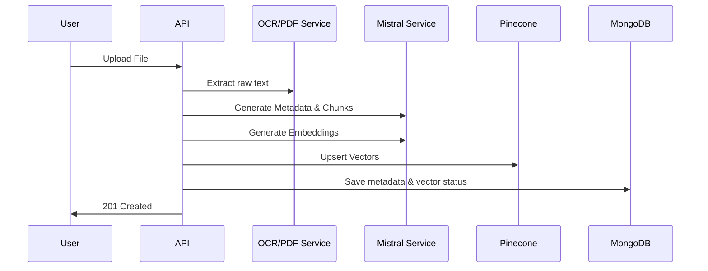
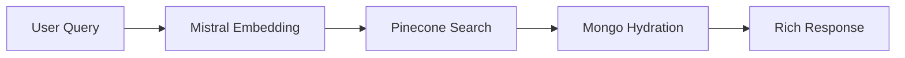

# Project Overview

The **Second Brain AI System** is a professional-grade personal knowledge management platform. It allows users to capture, process, and retrieve digital information (URLs, PDFs, Images) through an AI-first architecture. Unlike traditional bookmarking tools, this system performs deep content extraction, semantic vectorization, and automated metadata enrichment to create a searchable "Artificial Cortex."

---

# Current System Architecture

The application follows a modern **Clean Architecture** with a clear separation between the ingestion pipeline, intelligence layer, and user interface.

- **Frontend**: React-based SPA with Redux Toolkit for state management, Framer Motion for high-end micro-interactions, and a responsive Masonry Grid for content visualization.
- **Backend**: Node.js/Express REST API.
- **Intelligence Layer**: LangChain orchestration using Mistral AI for metadata generation and text embeddings.
- **Storage Strategy**:
  - **MongoDB**: Primary metadata and user record storage.
  - **Pinecone**: Vector database for document chunk embeddings.
  - **ImageKit**: Cloud storage for uploaded assets and thumbnails.

---

# Backend Flow

### 1. Upload Pipeline (Files)
- **Ingestion**: `Multer` accepts memory-stored buffers.
- **Extraction**:
  - **PDFs**: Parsed via `pdf-parse`.
  - **Images**: Read via `Tesseract.js` (OCR).
- **Processing**:
  - Raw text is normalized and sent to **Mistral AI** to generate a clean Title, Description, and Tags.
  - Text is split into overlapping 1000-character chunks via `RecursiveCharacterTextSplitter`.
- **Vectorization**: Each chunk is embedded using `mistral-embed`.
- **Persistence**:
  - Vectors are stored in **Pinecone** with `userId` and `contentId` metadata.
  - File is uploaded to **ImageKit**.
  - Final metadata and URLs are saved in **MongoDB**.

### 2. Save Link Pipeline (URLs)
- **Scraping**: `ogs` (Open Graph Scraper) extracts baseline metadata.
- **Enhancement**: Mistral AI generates fallback descriptions for platforms like Instagram where OG data is often restricted.
- **Indexing**: Currently saves metadata to MongoDB and triggers vectorization for searchable content.

### 3. Semantic Search Pipeline
- **Vectorization**: User query is converted into a 1024-dimension vector via `embedQuery`.
- **Retrieval**: Pinecone finds top `K` relevant chunks filtered by `userId`.
- **Hydration**: Backend matches Pinecone `contentId` metadata with MongoDB documents to return rich, display-ready objects.

---

# Frontend Flow

### 1. Knowledge Canvas Rendering
- **Data Fetching**: Authenticated requests via standard `apiClient`.
- **State**: Redux `contentSlice` stores all user items.
- **Layout**: `MasonryGrid` dynamically arranges items of varying heights.
- **Animations**: Entrance and hover states are handled by `Framer Motion` for a premium feel.

### 2. Search Integration
- **Hybrid Search**:
  - When search input is empty: Local state filtering by Category/Tags.
  - When typing: **Debounced (350ms) Semantic Search** request to the backend.
- **UX**: The dashboard shows a "Semantic matches" indicator and handles loading/empty states elegantly.

---

# Feature Status (Done / Partial / Missing)

### ✅ Implemented Features
- **Semantic Search**: Fully functional vector-based search using Pinecone + Mistral.
- **OCR Engine**: Tesseract-powered text extraction from images.
- **PDF Processing**: Full text parsing and chunking for documents.
- **AI Enrichment**: Automatic title, tag, and summary generation.
- **Hybrid Storage**: Sync between MongoDB and Pinecone.
- **Image Proxying**: Backend service to bypass CORS/Hotlinking for link previews.
- **Premium UI**: Glassmorphic dashboard with responsive masonry grid.

### ⚠️ Partially Implemented
- **Platform-Specific Scraping**: Basic metadata via Open Graph is live, but deep transcript/thread extraction (YouTube/Twitter) is missing.
- **Authentication**: JWT-based session management is implemented with cookies, but refresh token rotation is minimal.

### ❌ Missing Features
- **RAG Chat**: No interface to "Chat with your data" using retrieved chunks.
- **Knowledge Graph**: No visual visualization of item relationships (Nodes/Edges).
- **Topic Clustering**: No automated grouping of items into "Collections" based on vector similarity.
- **Resurfacing**: No Spaced Repetition or "On this day" discovery features.

---

# Vector System Explanation

The system uses a **Retrieval Augmented** approach for search:
- **Model**: `mistral-embed` (1024 dimensions).
- **Chunking Strategy**: 1000 characters per chunk, 150 characters overlap to preserve context at boundaries.
- **ID Strategy**: Deterministic IDs (`contentId-chunk-index`) allow for precise updates and deletions.
- **Filtering**: Pinecone metadata filtering (`userId`) ensures strict data isolation between users at the database layer.

---

# Diagrams

### Upload & Vector Flow


### Semantic Search Flow


---

# Gap Analysis

| Missing Component | Impact | Needed Fix |
| :--- | :--- | :--- |
| **RAG Generation** | High | Create `/chat` endpoint that combines retrieved chunks into a prompt for `mistral-chat`. |
| **Knowledge Graph** | High | Build API to return similarity edges and use `D3.js` for visualization. |
| **Deep Scrapers** | Medium | Replace `ogs` with specialized scrapers for YouTube transcripts and Twitter thread reconstruction. |
| **Topic Clustering** | Low | Implement K-Means clustering on existing vectors to auto-generate categories. |

---

# Next Execution Plan

### 1. Implement RAG Chat
- **Task**: Allow users to ask questions about their saved knowledge.
- **Where**: New `chat.controller.js` and `ai.service.js` function `generateAnswerWithContext`.
- **Requirement**: Use existing search logic to get `topK` chunks, then pass to Mistral Chat.

### 2. Knowledge Graph API
- **Task**: Provide data for visual relationship mapping.
- **Where**: `search.controller.js` -> `getKnowledgeGraphData`.
- **Logic**: Calculate similarity scores between item vectors and return as graph edges.

### 3. Advanced YouTube Scraper
- **Task**: High-fidelity video archiving.
- **Where**: `youtube-metadata.service.js`.
- **Library**: `youtube-transcript`.

### 4. Image Preview Fixes
- **Task**: Improve preview reliability for restricted hosts.
- **Where**: `content.controller.js` -> `proxyContentImageController`.
- **Fix**: Handle custom Referer headers for Instagram/LinkedIn blocks.

---

# Updated Folder Structure

```text
/second-brain-backend
  /src
    /controllers    # API logic (content, search, auth)
    /services       # Business logic (ai, vector, embedding, extract)
      /metadata     # Specialized scrapers (Shared, YT)
    /models         # Mongoose schemas
    /middlewares    # Auth & Error handling
    /routes         # API endpoint definitions

/second-brain-frontend
  /src
    /api            # Axios wrappers
    /components     # UI atoms & layout (GlassCard, Sidebar)
    /hooks          # State logic (useContent, useAuth)
    /redux          # Global state (contentSlice, authSlice)
    /pages          # Dashboard & Auth views
```
