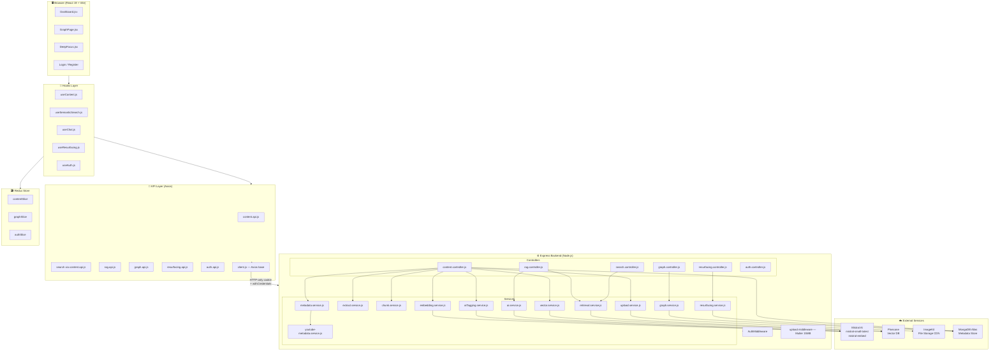
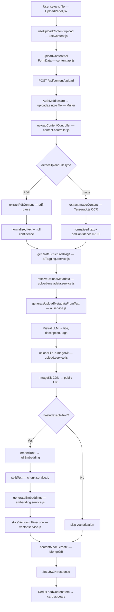
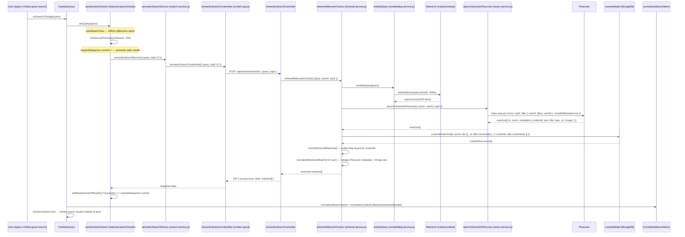
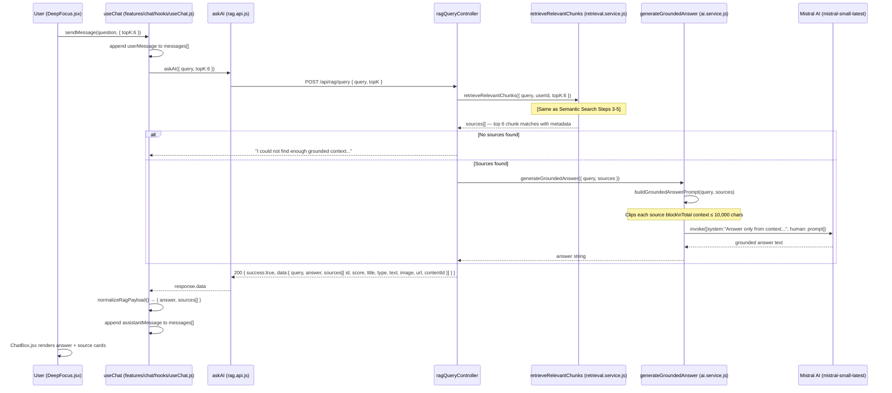
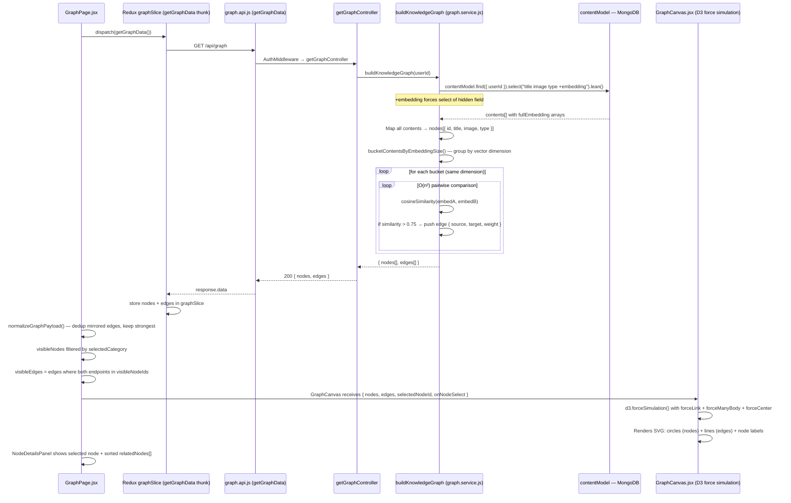
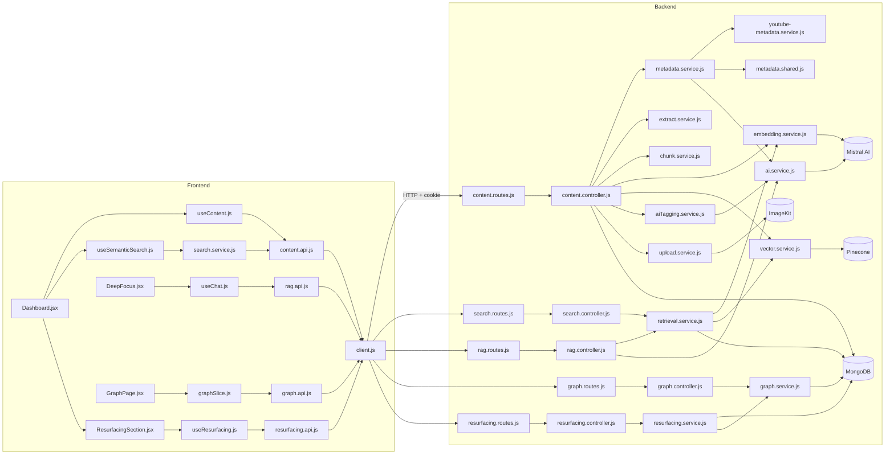

# 🧠 Second Brain App — System Architecture Blueprint

> **For:** Senior engineer onboarding, production system understanding, debugging, and extension.
> **Source:** 100% derived from direct code inspection. No assumptions made.

---

## 📋 Table of Contents

1. [System Architecture Overview](#1-system-architecture-overview)
2. [Full Folder Structure](#2-full-folder-structure)
3. [File Responsibility Mapping](#3-file-responsibility-mapping)
4. [API Route Map](#4-api-route-map)
5. [Pipeline Flow 1 — URL Save](#5-pipeline-flow-1--url-save)
6. [Pipeline Flow 2 — File Upload (PDF / Image)](#6-pipeline-flow-2--file-upload-pdf--image)
7. [Pipeline Flow 3 — YouTube Save](#7-pipeline-flow-3--youtube-save)
8. [Pipeline Flow 4 — Semantic Search](#8-pipeline-flow-4--semantic-search)
9. [Pipeline Flow 5 — RAG Chat (Deep Focus)](#9-pipeline-flow-5--rag-chat-deep-focus)
10. [Pipeline Flow 6 — Knowledge Graph](#10-pipeline-flow-6--knowledge-graph)
11. [Pipeline Flow 7 — Memory Resurfacing](#11-pipeline-flow-7--memory-resurfacing)
12. [Authentication Flow](#12-authentication-flow)
13. [Connection Map (Who Calls What)](#13-connection-map-who-calls-what)
14. [Data Model (MongoDB Schema)](#14-data-model-mongodb-schema)

---

## 1. System Architecture Overview



---

## 2. Full Folder Structure

```
Second Brain App/
├── analysis.md                          ← Project health analysis
├── architecture.md                      ← This file
│
├── second-brain-backend/
│   ├── app.js                           ← Express app factory (routes + middleware)
│   ├── server.js                        ← HTTP server entry point
│   ├── eng.traineddata                  ← Tesseract OCR English language data
│   ├── .env                             ← Secrets (MISTRAL, PINECONE, MONGO, etc.)
│   └── src/
│       ├── config/                      ← DB connection config
│       ├── controllers/
│       │   ├── auth.controller.js       ← register, login, checkAuth, logout
│       │   ├── content.controller.js    ← saveContent, upload, getAll, delete, imageProxy
│       │   ├── graph.controller.js      ← getGraph (nodes + edges)
│       │   ├── rag.controller.js        ← ragQuery (RAG chat)
│       │   ├── resurfacing.controller.js← getResurfaced (time-based recall)
│       │   └── search.controller.js     ← semanticSearch (Pinecone query)
│       ├── middlewares/
│       │   ├── auth.middleware.js       ← JWT cookie verify + user attach
│       │   └── upload.middleware.js     ← Multer memory storage (15MB limit)
│       ├── models/
│       │   ├── content.model.js         ← Content schema (Mongoose)
│       │   └── user.model.js            ← User schema (bcrypt)
│       ├── routes/
│       │   ├── auth.routes.js           ← /api/auth/*
│       │   ├── content.routes.js        ← /api/content/*
│       │   ├── graph.routes.js          ← /api/graph/*
│       │   ├── rag.routes.js            ← /api/rag/*
│       │   ├── resurfacing.routes.js    ← /api/resurface/*
│       │   └── search.routes.js         ← /api/search/*, /api/search/semantic
│       ├── services/
│       │   ├── ai.service.js            ← Mistral LLM calls (metadata, RAG answer, Instagram fallback)
│       │   ├── aiTagging.service.js     ← Structured Zod tagging via LangChain parser
│       │   ├── chunk.service.js         ← RecursiveCharacterTextSplitter (1000 chars, 150 overlap)
│       │   ├── embedding.service.js     ← MistralAIEmbeddings (chunk embed, doc embed, query embed)
│       │   ├── extract.service.js       ← Tesseract.js OCR + pdf-parse text extraction
│       │   ├── graph.service.js         ← Cosine similarity + knowledge graph builder
│       │   ├── metadata.service.js      ← URL scraper orchestrator (OGS + platform routing)
│       │   ├── metadata/
│       │   │   ├── metadata.shared.js   ← Platform detection, title/desc/image extraction, tag generation
│       │   │   └── youtube-metadata.service.js ← YouTube oEmbed + video ID extraction
│       │   ├── resurfacing.service.js   ← Date-window query + multi-signal ranking
│       │   ├── retrieval.service.js     ← Embed query → Pinecone search → Mongo hydration
│       │   ├── upload-metadata.service.js ← Resolves AI metadata for file uploads
│       │   ├── upload.service.js        ← ImageKit upload + delete
│       │   └── vector.service.js        ← Pinecone upsert, query, delete, id builder
│       └── utils/
│           └── CleanTitle.js            ← Sanitizes scraped title text
│
└── second-brain-frontend/
    ├── index.html
    ├── vite.config.js
    └── src/
        ├── App.jsx                      ← Route definitions
        ├── main.jsx                     ← React root + Redux Provider
        ├── api/
        │   ├── client.js                ← Axios instance (baseURL + withCredentials)
        │   ├── auth.api.js              ← login, register, logout, checkAuth
        │   ├── content.api.js           ← getContent, save, upload, delete, semanticSearch
        │   ├── graph.api.js             ← getGraph
        │   ├── rag.api.js               ← askAI
        │   └── resurfacing.api.js       ← getResurfaced
        ├── components/
        │   ├── cards/                   ← Card variants
        │   ├── chat/                    ← ChatBox.jsx, MessageBubble.jsx
        │   ├── content/
        │   │   ├── ContentCard.jsx      ← Unified card component
        │   │   ├── MasonryGrid.jsx      ← react-masonry-css layout
        │   │   ├── TagChip.jsx          ← Clickable tag filter pill
        │   │   └── utils/               ← normalizeContentCollection, contentNormalizer
        │   ├── graph/
        │   │   ├── GraphCanvas.jsx      ← D3 force-directed simulation
        │   │   ├── NodeDetailsPanel.jsx ← Selected node info + related nodes
        │   │   └── GraphNode.jsx / GraphView.jsx
        │   ├── layout/
        │   │   └── MainLayout.jsx       ← Shell with navbar, search, categories
        │   └── ui/
        │       ├── Button.jsx
        │       └── GlassCard.jsx
        ├── features/
        │   ├── chat/
        │   │   └── hooks/useChat.js     ← RAG chat state manager
        │   ├── resurfacing/
        │   │   ├── ResurfacingSection.jsx ← Dashboard component
        │   │   ├── ResurfacedCard.jsx
        │   │   └── hooks/useResurfacing.js
        │   └── search/
        │       ├── hooks/useSemanticSearch.js ← Debounced search hook
        │       └── search.service.js    ← Calls semanticSearchContentApi
        ├── hooks/
        │   ├── useAuth.js               ← Login, register, logout, checkAuth
        │   └── useContent.js            ← getContent, save, upload, delete, filter
        ├── pages/
        │   ├── dashboard/Dashboard.jsx  ← Main knowledge canvas
        │   ├── GraphPage.jsx            ← Semantic relationship engine
        │   ├── DeepFocus.jsx            ← RAG chat interface
        │   └── auth/                    ← Login + Register pages
        ├── redux/
        │   ├── store.js
        │   ├── graphSlice.js            ← nodes, edges, loading, error
        │   └── slices/
        │       ├── authSlice.js         ← user, token state
        │       └── contentSlice.js      ← items, loading, error
        └── utils/
            ├── api-error.js             ← Extracts readable error messages
            └── toast.js                 ← react-toastify wrapper
```

---

## 3. File Responsibility Mapping

### Backend — Controllers

| File                          | Function(s)                        | What It Does                                                                 | Called By                                 |
| ----------------------------- | ---------------------------------- | ---------------------------------------------------------------------------- | ----------------------------------------- |
| `auth.controller.js`        | `registerController`             | Creates user in MongoDB, returns user object (no password)                   | `POST /api/auth/register`               |
|                               | `userLoginController`            | Verifies password with bcrypt, signs JWT, sets `jwtToken` HTTP-only cookie | `POST /api/auth/login`                  |
|                               | `checkAuthController`            | Returns `req.user` (already populated by middleware)                       | `GET /api/auth/me`                      |
|                               | `logoutController`               | Clears `jwtToken` cookie                                                   | `POST /api/auth/logout`                 |
| `content.controller.js`     | `saveContentController`          | Full URL save pipeline (8 steps)                                             | `POST /api/content/save`                |
|                               | `uploadContentController`        | Full file upload pipeline, dual rollback logic                               | `POST /api/content/upload`              |
|                               | `getContentAllController`        | `find({ userId }).sort({ createdAt: -1 })`                                 | `GET /api/content/get-all`              |
|                               | `getSingleUserContentController` | Same as above (alias route)                                                  | `GET /api/content/get-single-user`      |
|                               | `DeleteContentController`        | Find + delete from MongoDB + delete Pinecone vectors                         | `DELETE /api/content/delete/:id`        |
|                               | `proxyContentImageController`    | Proxies third-party images (SSRF-guarded)                                    | `GET /api/content/image-proxy` (public) |
| `search.controller.js`      | `semanticSearchController`       | Embeds query → Pinecone ANN → MongoDB hydration                            | `POST /api/search/semantic`             |
| `rag.controller.js`         | `ragQueryController`             | Retrieves top chunks → Mistral grounded answer                              | `POST /api/rag/query`                   |
| `graph.controller.js`       | `getGraphController`             | Builds cosine-similarity graph from saved embeddings                         | `GET /api/graph`                        |
| `resurfacing.controller.js` | `getResurfacedController`        | Returns ranked content from `monthsAgo` date window                        | `GET /api/resurface`                    |

### Backend — Services

| File                                     | Key Functions                                                                                                                 | Purpose                                                                                                               |
| ---------------------------------------- | ----------------------------------------------------------------------------------------------------------------------------- | --------------------------------------------------------------------------------------------------------------------- |
| `metadata.service.js`                  | `getMetadata(url)`                                                                                                          | Routes URLs to YouTube handler or generic OGS scraper; builds `{ title, description, image, type, tags }`           |
| `metadata/metadata.shared.js`          | `detectPlatform`, `extractBestTitle`, `extractBestDescription`, `extractBestImage`, `mapType`                       | Shared title/image/tag extraction logic; platform detection (youtube, twitter, linkedin, instagram, github, web)      |
| `metadata/youtube-metadata.service.js` | `getYouTubeMetadata`, `extractYouTubeId`, `buildYouTubeThumbnail`                                                       | Fetches oEmbed JSON from YouTube for real video titles + thumbnails                                                   |
| `extract.service.js`                   | `extractFileContent`, `detectUploadFileType`                                                                              | Routes buffers to pdf-parse or Tesseract.js; returns `{ text, ocrConfidence, fileType }`                            |
| `chunk.service.js`                     | `splitText`                                                                                                                 | LangChain `RecursiveCharacterTextSplitter` (1000 chars, 150 overlap) → max 500 chunks                              |
| `embedding.service.js`                 | `generateEmbeddings`, `embedText`, `embedQuery`                                                                         | Wraps `MistralAIEmbeddings` (model: `mistral-embed`); separate functions for chunks, full-doc, and query vectors  |
| `vector.service.js`                    | `storeVectorsInPinecone`, `searchVectorsInPinecone`, `deleteVectorsFromPinecone`, `buildVectorIds`                    | All Pinecone operations; deterministic vector IDs (`{contentId}-chunk-{index}`); user-level `$eq` filter          |
| `ai.service.js`                        | `generateUploadMetadataFromText`, `generateGroundedAnswer`, `generateInstagramDescriptionFallback`, `getMistralModel` | LLM calls via `ChatMistralAI`; lazy-initialized singleton model                                                     |
| `aiTagging.service.js`                 | `generateStructuredTags`                                                                                                    | Zod schema + LangChain `StructuredOutputParser` → `{ category, subCategory, tags[] }`                            |
| `retrieval.service.js`                 | `retrieveRelevantChunks`                                                                                                    | Orchestrates:`embedQuery` → `searchVectorsInPinecone` → `enrichRetrievedMatches` (MongoDB hydration)          |
| `graph.service.js`                     | `buildKnowledgeGraph`, `cosineSimilarity`                                                                                 | Fetches all user embeddings from Mongo; O(n²) pairwise similarity → edges at threshold > 0.75                       |
| `resurfacing.service.js`               | `getResurfacedContent`, `formatResurfacingLabel`                                                                          | Date-window Mongo query + multi-signal ranking (temporal 34%, semantic 26%, access 14%, importance 14%, richness 12%) |
| `upload.service.js`                    | `uploadFileToImageKit`, `deleteFileFromImageKit`                                                                          | ImageKit NodeJS SDK file upload/delete                                                                                |
| `upload-metadata.service.js`           | `resolveUploadMetadata`                                                                                                     | Orchestrates `generateUploadMetadataFromText` for file uploads                                                      |

### Backend — Middlewares

| File                     | Function           | Purpose                                                                                                                   |
| ------------------------ | ------------------ | ------------------------------------------------------------------------------------------------------------------------- |
| `auth.middleware.js`   | `AuthMiddleware` | Reads `jwtToken` cookie → `jwt.verify` → DB lookup → attaches `req.user = { id, username, email }` → `next()` |
| `upload.middleware.js` | `upload`         | `multer.memoryStorage()` with 15MB file size limit; attaches `req.file`                                               |

### Frontend — Key Files

| File                                           | Exports                                                                                                         | Purpose                                                                                                             |
| ---------------------------------------------- | --------------------------------------------------------------------------------------------------------------- | ------------------------------------------------------------------------------------------------------------------- |
| `api/client.js`                              | `apiClient`                                                                                                   | Axios instance with `baseURL = VITE_API_URL`, `withCredentials: true` (cookie auto-attach)                      |
| `api/content.api.js`                         | `getContentApi`, `saveContentApi`, `uploadContentApi`, `deleteContentApi`, `semanticSearchContentApi` | Raw Axios calls to backend content + search endpoints                                                               |
| `api/rag.api.js`                             | `askAI`                                                                                                       | POST `/api/rag/query` with `{ query, topK }`                                                                    |
| `api/graph.api.js`                           | `getGraphData`                                                                                                | GET `/api/graph`                                                                                                  |
| `api/resurfacing.api.js`                     | `getResurfacedApi`                                                                                            | GET `/api/resurface?monthsAgo=N`                                                                                  |
| `features/search/hooks/useSemanticSearch.js` | `useSemanticSearch`                                                                                           | Debounced search hook;`requestSequence` ref prevents stale results; `autoSearch: true` triggers on query change |
| `features/chat/hooks/useChat.js`             | `useChat`                                                                                                     | Chat message state + calls `askAI` → normalizes `{ answer, sources[] }` into message objects                   |
| `features/resurfacing/`                      | `ResurfacingSection`, `useResurfacing`                                                                      | Fetches 2-month-ago content, renders up to 3 cards on Dashboard when not searching                                  |
| `hooks/useContent.js`                        | `useGetContent`, `useSaveContent`, `useUploadContent`, `useDeleteContent`, `useFilteredContent`       | Redux-integrated content operations + client-side tag/category filtering                                            |
| `redux/slices/contentSlice.js`               | `setContentData`, `addContentItem`, `removeContentItem`                                                   | Normalized Redux state for the content feed                                                                         |
| `redux/graphSlice.js`                        | `getGraphData` (thunk)                                                                                        | Fetches graph from backend, stores `nodes + edges`                                                                |

---

## 4. API Route Map

```
Backend base: http://localhost:3000/api
Frontend base: VITE_API_URL (defaults to http://localhost:3000/api)

AUTH (no auth required except /me):
  POST   /api/auth/register        → registerController
  POST   /api/auth/login           → userLoginController   (sets jwtToken cookie)
  GET    /api/auth/me              → checkAuthController   [AuthMiddleware]
  POST   /api/auth/logout          → logoutController      (clears jwtToken cookie)

CONTENT (all require AuthMiddleware, except image-proxy):
  GET    /api/content/image-proxy  → proxyContentImageController  [PUBLIC]
  POST   /api/content/save         → saveContentController         [AuthMiddleware]
  POST   /api/content/upload       → uploadContentController       [AuthMiddleware + Multer]
  GET    /api/content/get-all      → getContentAllController       [AuthMiddleware]
  GET    /api/content/get-single-user → getSingleUserContentController [AuthMiddleware]
  DELETE /api/content/delete/:id   → DeleteContentController       [AuthMiddleware]

SEARCH:
  POST   /api/search/semantic      → semanticSearchController      [AuthMiddleware]
  POST   /api/search               → semanticSearchController      [AuthMiddleware] (alias)

RAG:
  POST   /api/rag/query            → ragQueryController            [AuthMiddleware]

GRAPH:
  GET    /api/graph                → getGraphController            [AuthMiddleware]

RESURFACING:
  GET    /api/resurface            → getResurfacedController       [AuthMiddleware]
                                     ?monthsAgo=2&debug=false
```

---

## 5. Pipeline Flow 1 — URL Save

**User pastes a URL and clicks Save.**

```
sequenceDiagram
    participant U as User (Dashboard.jsx)
    participant H as useSaveContent (useContent.js)
    participant A as saveContentApi (content.api.js)
    participant MW as AuthMiddleware
    participant C as saveContentController (content.controller.js)
    participant META as getMetadata (metadata.service.js)
    participant YT as getYouTubeMetadata (youtube-metadata.service.js)
    participant OGS as open-graph-scraper
    participant CHUNK as splitText (chunk.service.js)
    participant EMBED as embedText + generateEmbeddings (embedding.service.js)
    participant MISTRAL as Mistral AI (mistral-embed)
    participant VEC as storeVectorsInPinecone (vector.service.js)
    participant PINECONE as Pinecone
    participant AITAG as generateStructuredTags (aiTagging.service.js)
    participant LLM as Mistral AI (mistral-small-latest)
    participant DB as contentModel (MongoDB)
    participant REDUX as Redux contentSlice

    U->>H: handleSave(url)
    H->>A: saveContentApi({ url })
    A->>MW: POST /api/content/save (cookie: jwtToken)
    MW->>MW: jwt.verify → DB lookup → req.user = { id }
    MW->>C: next()
    C->>C: normalizeComparableUrl(url) — strips UTM, hash, sorts params
    C->>DB: findOne({ userId, normalizedUrl }) — check duplicate
    alt URL already saved
        C-->>U: 200 { duplicate: true, message: "You already saved this on {date}" }
    end
    C->>META: getMetadata(url)
    META->>META: detectPlatform(url) → "youtube" | "twitter" | "linkedin" | "instagram" | "web"
    alt YouTube URL
        META->>YT: getYouTubeMetadata(url)
        YT->>YT: fetchYouTubeOEmbed(url) → youtube.com/oembed?url=...
        YT-->>META: { title, image(thumbnail), type:"youtube", tags }
    else All other URLs
        META->>OGS: ogs({ url })
        OGS-->>META: { ogTitle, ogDescription, ogImage, ... }
        META->>META: extractBestTitle / extractBestDescription / extractBestImage
        alt Instagram with no description
            META->>LLM: generateInstagramDescriptionFallback({ url, title, imageUrl })
            LLM-->>META: short neutral description
        end
    end
    META-->>C: { title, description, image, type, url, tags }
    C->>C: buildSavedContentIndexText({ title, description, tags, type, url })
    C->>EMBED: embedText(indexableText) → document-level vector
    EMBED->>MISTRAL: embedDocuments([text])
    MISTRAL-->>EMBED: fullEmbedding[1024 dims]
    C->>CHUNK: splitText(indexableText)
    CHUNK->>CHUNK: RecursiveCharacterTextSplitter(1000 chars, 150 overlap)
    CHUNK-->>C: chunks[]
    C->>EMBED: generateEmbeddings(chunks)
    EMBED->>MISTRAL: embedDocuments(chunks)
    MISTRAL-->>EMBED: embeddings[]
    C->>VEC: storeVectorsInPinecone({ embeddings, chunks, metadata:{ userId, title, contentId, type, url, image } })
    VEC->>VEC: buildVectorId(contentId, chunkIndex) → "{contentId}-chunk-{i}"
    VEC->>PINECONE: index.upsert({ records })
    PINECONE-->>VEC: ok
    VEC-->>C: vectorIds[]
    C->>AITAG: generateStructuredTags(indexableText)
    AITAG->>LLM: invoke([system, human]) with Zod StructuredOutputParser
    LLM-->>AITAG: { category, subCategory, tags[] }
    AITAG-->>C: structured tags
    C->>DB: contentModel.create({ _id, url, normalizedUrl, title, description, image, type, tags (merged), category, subCategory, userId, embedding, vectorIds, textChunks, vectorReady })
    DB-->>C: saved document
    C->>C: sanitizeContentDocument() — remove embedding, fileHash, normalizedUrl
    C-->>A: 201 { success: true, data: content }
    A-->>H: response.data
    H->>REDUX: dispatch(addContentItem(content))
    REDUX-->>U: Dashboard re-renders with new card
```

### Step-by-Step Details

**Step 1 — Dashboard Input**

- **File:** `pages/dashboard/Dashboard.jsx`
- **Function:** `handleSave(event)`
- Input: URL string from `urlInput` state
- Validates `isValidHttpUrl()` before calling hook

**Step 2 — Save Hook**

- **File:** `hooks/useContent.js`
- **Function:** `useSaveContent().saveContent(contentData)`
- Dispatches `setContentLoading(true)`
- Wraps API call in `notify.promise()` (toast shows "Saving link...")
- On success: dispatches `addContentItem(payload)` → card appears immediately

**Step 3 — API Call**

- **File:** `api/content.api.js`
- **Function:** `saveContentApi({ url })`
- `apiClient.post('/content/save', data)` — Axios with `withCredentials: true`

**Step 4 — Auth Middleware**

- **File:** `middlewares/auth.middleware.js`
- **Function:** `AuthMiddleware`
- Reads `req.cookies.jwtToken` → `jwt.verify(token, JWT_SECRET)` → DB lookup → `req.user = { id, username, email }`

**Step 5 — Controller (8 internal steps)**

- **File:** `controllers/content.controller.js`
- **Function:** `saveContentController`
- `vectorIds = []` stored for rollback
- Duplicate check via `normalizeComparableUrl()` (strips UTM, hash, sorts params, normalizes ports)
- Pre-generates `contentObjectId = new mongoose.Types.ObjectId()` — used to link Pinecone ↔ MongoDB before DB write

**Step 6 — Metadata Extraction**

- **File:** `services/metadata.service.js`
- **Function:** `getMetadata(url)`
- Routes to `getYouTubeMetadata()` for YouTube, or `open-graph-scraper` for everything else
- Returns: `{ title, description, image, type, url, tags }`

**Step 7 — Vector Pipeline**

- **Files:** `chunk.service.js`, `embedding.service.js`, `vector.service.js`
- Text → chunks (1000 chars / 150 overlap) → embeddings (`mistral-embed`) → Pinecone upsert
- Also generates one document-level embedding (`embedText`) for graph similarity later

**Step 8 — AI Tagging**

- **File:** `services/aiTagging.service.js`
- **Function:** `generateStructuredTags(text)`
- Zod schema: `{ category: string, subCategory: string, tags: string[] }`
- LangChain `StructuredOutputParser.fromZodSchema` ensures valid JSON output

**Step 9 — MongoDB Save**

- Schema fields: `title`, `url`, `normalizedUrl`, `type`, `tags`, `category`, `subCategory`, `embedding` (hidden by default), `vectorIds`, `textChunks`, `vectorReady`

**Rollback Logic:**

- If MongoDB write fails after Pinecone upsert → `deleteVectorsFromPinecone(vectorIds)` in catch block

---

## 6. Pipeline Flow 2 — File Upload (PDF / Image)

**User selects a file and clicks Upload.**



### Step-by-Step Details

**Step 1 — Frontend File Handling**

- **File:** `pages/dashboard/Dashboard.jsx`
- **Function:** `handleFileChange(event)`, `handleUpload(event)`
- Validates file with `isSupportedUploadFile()` (PDF, PNG, JPEG, WEBP, GIF, BMP, SVG)
- Builds `FormData` with `file` + optional `title`

**Step 2 — Multer Middleware**

- **File:** `middlewares/upload.middleware.js`
- `multer.memoryStorage()` — entire file stored in `req.file.buffer` (RAM, max 15MB)
- No disk writes; buffer passed directly to extraction services

**Step 3 — File Type Detection**

- **File:** `services/extract.service.js`
- **Function:** `detectUploadFileType(file)`
- Checks both MIME type and file extension
- Returns `"pdf"` or `"image"` or `null`

**Step 4a — PDF Extraction**

- **File:** `services/extract.service.js`
- **Function:** `extractPdfContent(buffer)`
- `new PDFParse({ data: buffer }).getText()` → raw text string
- Returns: `{ text: normalizedText, ocrConfidence: null, fileType: "pdf" }`

**Step 4b — Image OCR**

- **File:** `services/extract.service.js`
- **Function:** `extractImageContent(buffer)`
- `createWorker("eng")` → `worker.recognize(buffer)` → Tesseract.js
- Returns: `{ text, ocrConfidence: 0-100, fileType: "image" }`
- Worker terminated in `finally` block (no memory leak)

**Step 5 — AI Metadata Generation**

- **File:** `services/upload-metadata.service.js` → `services/ai.service.js`
- **Function:** `resolveUploadMetadata` → `generateUploadMetadataFromText`
- Prompt context: file name, file type, OCR confidence, extracted text
- Returns: `{ title, description, tags }`

**Step 6 — ImageKit Upload**

- **File:** `services/upload.service.js`
- **Function:** `uploadFileToImageKit(file, { userId, uploadType })`
- Uploads buffer to ImageKit CDN
- Returns: `{ url, thumbnailUrl, fileId }`

**Dual Rollback Logic:**

```
If Mongo write fails after Pinecone success → deleteVectorsFromPinecone(vectorIds)
If Mongo write fails after ImageKit success → deleteFileFromImageKit(uploadedFileId)
Both run independently in catch block to avoid cascading failures.
```

---

## 7. Pipeline Flow 3 — YouTube Save

**User pastes a YouTube URL.**

```mermaid
flowchart LR
    A[YouTube URL] --> B[saveContentController]
    B --> C[getMetadata url]
    C --> D[detectPlatform url → 'youtube']
    D --> E[getYouTubeMetadata url]
    E --> F[extractYouTubeId url]
    F --> G{URL format?}
    G -->|youtube.com/watch?v=X| H[searchParams.get 'v']
    G -->|youtu.be/X| I[pathname.split /+/ 0]
    G -->|/shorts/X or /embed/X| J[pathname.split filter 1]
    H & I & J --> K[videoId]
    E --> L[fetchYouTubeOEmbed url]
    L --> M[GET youtube.com/oembed?url=...&format=json]
    M --> N{oEmbed available?}
    N -->|Yes| O[title from oEmbed.title\nthumb from oEmbed.thumbnail_url]
    N -->|No| P[buildYouTubeThumbnail videoId\nimg.youtube.com/vi/{id}/hqdefault.jpg]
    O --> Q['description: empty string']
    P --> Q
    Q --> R[type: 'youtube'\nNo transcript extracted]
    R --> S[buildSavedContentIndexText\nTitle: X + Type: youtube + URL: ...]
    S --> T[Vector pipeline with title-only text]
    T --> U[MongoDB save]
```

**Critical Gap to Note:**

- `description: ""` — YouTube has no transcript integration
- Vector embedding is only generated from: `"Title: {title}\nType: youtube\nSource URL: {url}"`
- This makes YouTube content nearly unsearchable semantically

---

## 8. Pipeline Flow 4 — Semantic Search

**User types in the search box on Dashboard.**



### Step-by-Step Details

**Step 1 — Search Input**

- **File:** `pages/dashboard/Dashboard.jsx`
- **Function:** `handleSearchChange(nextQuery)`
- Changes toggle `isSearchActive = Boolean(query.trim())`
- When active: replaces feed with `normalizedSearchItems`

**Step 2 — Debounce Hook**

- **File:** `features/search/hooks/useSemanticSearch.js`
- **Function:** `useSemanticSearch({ autoSearch: true, debounceMs: 350, topK: 12 })`
- Uses `requestSequence` ref to cancel stale requests (race condition prevention)
- `clearSearch()` increments the sequence to cancel all in-flight requests

**Step 3 — Query Embedding**

- **File:** `services/embedding.service.js`
- **Function:** `embedQuery(query)`
- `MistralAIEmbeddings.embedQuery(query.slice(0, 4000))` → 1024-dimensional vector

**Step 4 — Pinecone ANN Search**

- **File:** `services/vector.service.js`
- **Function:** `searchVectorsInPinecone({ vector, userId, topK })`
- User-level filter: `{ userId: { $eq: userId } }` — each user only sees their own vectors
- Returns: `matches[{ id, score, metadata }]`

**Step 5 — MongoDB Hydration**

- **File:** `services/retrieval.service.js`
- **Function:** `enrichRetrievedMatches`
- Batches `contentId` lookup into one `find()` call
- Merges Pinecone metadata (fast, real-time) with Mongo doc (full description, tags, createdAt)

---

## 9. Pipeline Flow 5 — RAG Chat (Deep Focus)

**User types a question in Deep Focus.**



### Context Budget:

- Max RAG context: `10,000 characters` across all source blocks
- Per chunk max: `1,200 characters`
- System prompt: "Answer only from the provided context. If context is incomplete, say so clearly."

---

## 10. Pipeline Flow 6 — Knowledge Graph

**User visits GraphPage or clicks Refresh Graph.**



### Cosine Similarity (manual implementation in `graph.service.js`):

```
dot = Σ(a[i] * b[i])
normA = √(Σ(a[i]²))
normB = √(Σ(b[i]²))
similarity = dot / (normA * normB)
Edge created only if similarity > 0.75
```

### Graph Rendering:

- D3 force-directed simulation (`forceLink`, `forceManyBody`, `forceCenter`)
- Category filter maps content `type` → UI category (`pdf/document` → Documents, `youtube` → Video, etc.)
- `resolvePreferredNodeId`: auto-selects the most-connected node on load

---

## 11. Pipeline Flow 7 — Memory Resurfacing

**Dashboard loads → ResurfacingSection fetches content saved 2 months ago.**

```mermaid
flowchart TD
    A[Dashboard mounts] --> B{isSearchActive?}
    B -->|No| C[ResurfacingSection renders]
    C --> D[useResurfacing hook — monthsAgo=2]
    D --> E[getResurfacedApi — resurfacing.api.js]
    E --> F[GET /api/resurface?monthsAgo=2]
    F --> G[getResurfacedController]
    G --> H[getResurfacedContent — resurfacing.service.js]
    H --> I[buildDateWindow monthsAgo=2]
    I --> J[start = 3 months ago\nend = 2 months ago]
    J --> K[findResurfacingCandidates]
    K --> L[contentModel.find — userId + createdAt in range\n.select +embedding — max 40 items]
    L --> M[buildSimilarityScoreMap candidates]
    M --> N[pairwise cosineSimilarity — within window\nfloor 0.45 — top 3 neighbors]
    N --> O[rankResurfacingCandidates]
    O --> P[score = temporal×0.34 + semantic×0.26\n+ access×0.14 + importance×0.14\n+ richness×0.12]
    P --> Q[sort descending → slice 0..10]
    Q --> R[sanitizeResurfacedContent — remove embedding]
    R --> S[return data + meta label]
    S --> T[ResurfacingSection shows top 3 cards]
    T --> U[normalizeContentCollection context='resurfacing']
    U --> V[Filter: only cards still in active archive]
    V --> W[ContentCard renders with MasonryGrid]
```



### Scoring Signals:

| Signal              | Weight | What It Measures                                                                 |
| ------------------- | ------ | -------------------------------------------------------------------------------- |
| `temporalScore`   | 34%    | Closeness of `createdAt` to the month anchor date                              |
| `similarityScore` | 26%    | Average cosine similarity to top-3 neighbors within the window                   |
| `accessScore`     | 14%    | `log(accessCount+1)/log(20)` — **NOTE: always 0 (field never written)** |
| `importanceScore` | 14%    | Important tags + tag density + category + subCategory presence                   |
| `richnessScore`   | 12%    | Summary + description + image + URL + vectorReady + embedding present            |

---

## 12. Authentication Flow

```mermaid
sequenceDiagram
    participant U as Login Page
    participant HA as useAuth.js
    participant AA as auth.api.js
    participant AC as auth.controller.js
    participant DB as userModel
    participant RX as authSlice (Redux)

    U->>HA: login({ email, password })
    HA->>AA: POST /api/auth/login { email, password }
    AA->>AC: userLoginController
    AC->>DB: userModel.findOne({ email })
    DB-->>AC: user doc with hashed password
    AC->>AC: user.comparePassword(password) — bcrypt.compare
    AC->>AC: jwt.sign({ id: user._id }, JWT_SECRET, { expiresIn: '7d' })
    AC->>AA: Set-Cookie: jwtToken=...; HttpOnly
    AA-->>HA: { success:true, data:{ user:{ id, username, email } } }
    HA->>RX: dispatch(setUser(user))
    RX-->>U: Navigate to Dashboard

    Note over U,DB: Every subsequent request:
    Note over U,DB: Browser auto-attaches jwtToken cookie
    Note over U,DB: AuthMiddleware verifies + attaches req.user
```

**Security properties:**

- Token stored in `HttpOnly` cookie → XSS-proof (JavaScript cannot read it)
- `withCredentials: true` on Axios → browser auto-attaches the cookie
- Token verified + DB user lookup on every protected route (live revocation possible)
- Logout: `res.clearCookie("jwtToken")` → token immediately invalid

---

## 13. Connection Map (Who Calls What)



---

## 14. Data Model (MongoDB Schema)

### Content Model (`content.model.js`)

```
Content {
  _id:           ObjectId           ← MongoDB document ID
  userId:        String   [indexed] ← Owner (from JWT)
  
  // Display fields
  title:         String   [required]
  url:           String   [required]
  description:   String
  image:         String              ← OG image URL or ImageKit URL
  summary:       String              ← Same as description (alias)
  type:          enum                ← "article"|"youtube"|"tweet"|"pdf"|"document"
                                       |"image"|"linkedin"|"instagram"|"github"|"x"
  
  // AI Organization
  tags:          [String]            ← Merged: metadata tags + AI tags (max 10)
  category:      String              ← Broad domain (Technology, Finance, etc.)
  subCategory:   String              ← Specific branch within category
  
  // Deduplication
  normalizedUrl: String   [indexed]  ← UTM-stripped, sorted-params URL (select:true)
  fileHash:      String   [indexed]  ← SHA-256 of file buffer (select:true)
  
  // Vector linking
  vectorReady:   Boolean  [indexed]  ← true if Pinecone vectors exist
  contentId:     String   [indexed]  ← App-level ID linking Mongo ↔ Pinecone
  vectorIds:     [String]            ← Array of "{contentId}-chunk-{i}" IDs
  textChunks:    [String]            ← Raw chunk text (for debug + fallback retrieval)
  embedding:     [Number] [select:false] ← Document-level embedding (for graph only)
  
  // Timestamps (auto)
  createdAt:     Date
  updatedAt:     Date
}

Compound Indexes:
  { userId: 1, createdAt: -1 }   ← Fast dashboard listing
  { userId: 1, contentId: 1 }    ← Pinecone → Mongo hydration
  { userId: 1, normalizedUrl: 1} ← URL duplicate check
  { userId: 1, fileHash: 1 }     ← File duplicate check
  { createdAt: -1 }              ← Resurfacing date queries
```

### User Model (`user.model.js`)

```
User {
  _id:        ObjectId
  username:   String [required, unique]
  email:      String [required, unique]  
  password:   String                     ← bcrypt hashed (pre-save hook)
  createdAt:  Date
  updatedAt:  Date
  
  Methods:
    comparePassword(candidatePassword) → boolean  ← bcrypt.compare
}
```

### Pinecone Vector Record

```
Vector {
  id:       "{contentId}-chunk-{chunkIndex}"  ← Deterministic, recoverable
  values:   [float × 1024]                    ← mistral-embed dimension
  metadata: {
    userId:     string    ← Filter key for multi-tenant isolation
    title:      string    ← For display without Mongo lookup
    contentId:  string    ← Links back to MongoDB _id
    chunkIndex: number    ← Which chunk this vector represents
    type:       string    ← article | pdf | image | youtube | ...
    url:        string    ← Clickable source
    image:      string    ← Preview thumbnail
    text:       string    ← Chunk text (max 1600 chars, for RAG context)
  }
}
```

---

*Architecture document generated: March 27, 2026. Based on direct inspection of every controller, service, model, route, page, hook, and API file in the project.*
