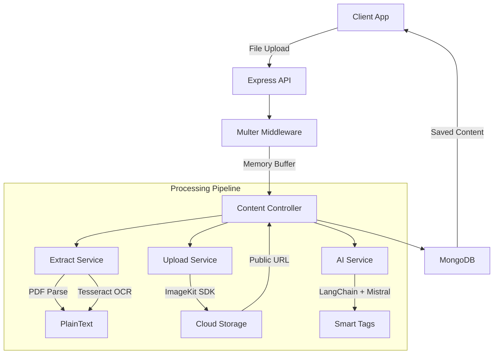

# 🧠 Second Brain Backend: AI-Powered Content Processing Architecture

This document details the architecture and implementation of the **Second Brain Backend**, focusing on today's major update: **Intelligent File Uploads (PDF & Images)** with OCR, AI-driven tagging, and ImageKit integration.

---

## 🏗️ System Architecture Overview

The system follows a modular service-oriented architecture designed for high scalability and clean separation of concerns.



---

## 🚀 Today's Work: Intelligent File Uploads

We have transformed the application from a simple bookmarking tool into a **Comprehensive Knowledge Processor**.

### 1. File Handling & Security

* **Multer Memory Storage**: Files are processed entirely in memory (up to 15MB) for maximum performance and security.
* **Type Validation**: Automatic detection of valid PDF and Image formats (`png`, `jpg`, `webp`, etc.).
* **Sanitization**: Filenames and user identifiers are sanitized to prevent path injection and ensure ImageKit compatibility.

### 2. Intelligent Extraction (`extract.service.js`)

The `ExtractService` is the "eyes" of the application:

* **PDF Parsing**: Uses `pdf-parse` to extract clean text from multi-page documents.
* **OCR (Optical Character Recognition)**: Integrated `tesseract.js` to read text from uploaded images, making visual content fully searchable.
* **Normalization**: Advanced regex-based cleanup of extracted text to remove null characters and collapse whitespace for cleaner AI prompts.

### 3. AI & LangChain Integration (`ai.service.js`)

We use **LangChain** with the **Mistral AI** model to power the brain of the app:

* **Smart Tagging**: The AI analyzes extracted text to generate 5-10 contextually relevant tags.
* **Prompt Engineering**: Context-aware prompts that include file metadata (name, type) to improve extraction accuracy.
* **Fallback Logic**: A deterministic keyword extractor ensures content is tagged and searchable even if the AI model is temporarily unavailable or if the text is sparse.

### 4. Cloud Asset Management (`upload.service.js`)

* **ImageKit Integration**: Original files are securely uploaded to ImageKit.
* **User-Scoped Storage**: Files are automatically organized into user-specific folders (`/second-brain/uploads/{userId}`).
* **Thumbnail Support**: Automatically generates thumbnails for PDFs and images to optimize frontend rendering.

---

## 📁 Updated Folder Structure

```text
second-brain-backend/
├── src/
│   ├── controllers/
│   │   └── content.controller.js    # Master orchestration of upload/extract/AI
│   ├── middlewares/
│   │   └── upload.middleware.js     # Multer memory storage configuration
│   ├── models/
│   │   └── content.model.js         # MongoDB Schema for unified content
│   ├── routes/
│   │   └── content.routes.js        # API Endpoints
│   └── services/
│       ├── ai.service.js            # LangChain + Mistral AI implementation
│       ├── extract.service.js       # OCR (Tesseract) & PDF text extraction
│       ├── metadata.service.js      # URL scraping & link previews
│       └── upload.service.js        # ImageKit cloud storage integration
├── .env                             # (Required) MISTRAL_API_KEY, IMAGEKIT_*
└── package.json                     # New dependencies: pdf-parse, tesseract.js, @langchain/mistralai
```

---

## 🛠️ Technical Deep Dive

### The Content Orchestration Flow

When a user uploads a file, the `uploadContentController` performs the following steps:

1. **Buffer Receipt**: Multer catches the file and provides a buffer.
2. **Parallel Extraction**:
   * `ExtractService` runs OCR/PDF-Parse.
   * `UploadService` sends the buffer to **ImageKit**.
3. **AI Inference**: The extracted text is sent to **Mistral AI** via LangChain to identify themes.
4. **Database Sync**: A unified document is created in MongoDB containing the public URL, AI tags, and OCR-extracted description.

---

## ⏩ Next Steps

- [ ] **Vector Embeddings**: Implement Pinecone/Chroma integration for semantic search over extracted text.
- [ ] **Chat-with-File**: Create a dedicated chat interface to query specific PDF/Image contents using RAG (Retrieval-Augmented Generation).
- [ ] **Progressive Uploads**: Add WebSocket-based progress tracking for large file OCR operations.

---

> [!TIP]
> **Environment Setup**: Ensure `MISTRAL_API_KEY`, `IMAGEKIT_PRIVATE_KEY`, and `IMAGEKIT_PUBLIC_KEY` are correctly set in your `.env` file to enable these features.
