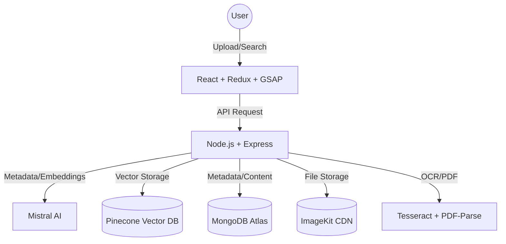
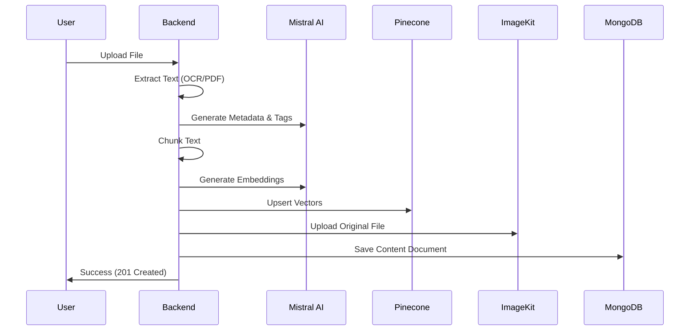

# Second Brain – System Update Report

**Date:** March 26, 2026

## 1. Overview
The **Second Brain** application has evolved into a sophisticated, AI-powered knowledge management system. It allows users to archive web links, upload documents (PDFs), and images. The system automatically processes these assets using OCR and PDF parsing, generates semantic embeddings, and stores them in a vector database (Pinecone) for advanced retrieval.

---

## 2. What Changed (Based on Git)
Recent updates focused on moving from a simple media-archiving tool to an intelligent retrieval system:
- **Added Semantic Search:** Replaced keyword-based filtering with vector search using Mistral AI embeddings and Pinecone.
- **Added Vector Storage:** Implemented a robust Pinecone integration for storing and querying document chunks.
- **Updated Upload Controller:** Integrated a multi-stage pipeline (Extract -> AI Metadata -> Chunk -> Embed -> Vector -> Storage).
- **OCR Integration:** Added `tesseract.js` for image text extraction and `pdf-parse` for documents.
- **Mistral AI Services:** Integrated Mistral for generating clean metadata (titles, tags, descriptions) and high-quality embeddings.
- **Image Proxy:** Added a backend proxy to handle third-party image previews and bypass hotlinking restrictions.

---

## 3. System Architecture

---

## 4. Upload Pipeline (REAL)

The upload pipeline is a 10-step reactive sequence designed for maximum data enrichment and reliability:

1.  **Multer:** Intercepts file upload in memory.
2.  **Detection:** Identifies if the file is a PDF or an Image.
3.  **Extraction:**
    -   **PDF:** Extracted via `pdf-parse`.
    -   **Image:** Extracted via `Tesseract.js` (OCR).
4.  **AI Metadata Generation:** Mistral AI analyzes extracted text to generate a professional `Title`, `Description`, and `Tags`.
5.  **Chunking:** Large text is split into overlapping 1000-character chunks using `RecursiveCharacterTextSplitter`.
6.  **Embeddings:** Each chunk is converted into a 1024-dimension vector via Mistral's `mistral-embed` model.
7.  **Pinecone Storage:** Vectors are stored with `userId` and `contentId` metadata for scoped retrieval.
8.  **ImageKit Upload:** The original file is saved to the CDN, and a public URL is returned.
9.  **MongoDB Persistence:** A final document is saved containing all UI metadata, CDN URLs, and a `vectorReady` flag.
10. **Cleanup:** If any stage fails after Pinecone, stored vectors are automatically deleted to prevent "ghost" search results.

---

## 5. Vector System

-   **Embeddings:** Generated using the `mistral-embed` model via LangChain.
-   **Storage:** Hosted on **Pinecone**.
-   **Metadata Mapping:** Every vector carries the following fields:
    -   `userId`: Ensures users only search their own data.
    -   `contentId`: Maps the vector hit back to the MongoDB document.
    -   `title`: Used for reference in search results.
    -   `type`: (image/pdf) preserved for filtering.

---

## 6. Semantic Search Flow

The system uses a **Hybrid Identification** approach to find the most relevant content:

1.  **Query Embedding:** The user's natural language query is converted into a vector.
2.  **Vector Search:** Pinecone returns the top `K` (default 5) matches filtered by `userId`.
3.  **Hydration:** The backend takes Pinecone `contentIds` and performs a bulk `$in` query on MongoDB to fetch the full rich metadata (images, URLs, tags).
4.  **Deduplication:** Multiple matching chunks from the same document are merged into a single result with the highest match score.

---

## 7. RAG FLOW (NOT IMPLEMENTED YET)

**Status:** Not implemented yet.
The system currently performs **Semantic Search & Retrieval**, but does not yet include the **Generation** step (sending retrieved chunks to an LLM to answer a specific user question). The infrastructure (Chunking + Vector Store) is however fully ready for this feature.

---

## 8. Frontend Flow

-   **API Integration:** Centralized API client (`api/client.js`) with specialized endpoints for `/search/semantic` and `/content/upload`.
-   **Custom Hooks:**
    -   `useUploadContent`: Manages multi-part form data and upload notifications.
    -   `useSemanticSearchContent`: Debounced search hook that interacts with the vector backend.
    -   `useFilteredContent`: Combines backend semantic results with frontend category/tag filtering.
-   **Redux:** Global `contentSlice` manages the state of archived items, ensuring real-time UI updates after uploads or deletions.
-   **Animations:** Integrated GSAP for smooth entrance animations and micro-interactions.

---

## 9. Issues Fixed
-   **Frontend Filtering:** Removed basic local JS filtering in favor of server-side Semantic Search.
-   **Metadata Mapping:** Fixed issues where Pinecone hits couldn't find their corresponding MongoDB documents by implementing deterministic `vectorId` and `contentId` mapping.
-   **OCR Noise:** Implemented an AI-cleaning layer that prevents garbled OCR text from appearing in the UI titles or descriptions.
-   **Hotlinking:** Implemented `/content/proxy` to fix broken images from external sources like LinkedIn or Twitter.

---

## 10. Current Capabilities
-   ✅ **Multi-format Support:** PDF and Image (PNG, JPG, WebP) processing.
-   ✅ **Deep Search:** Find documents based on *meaning* rather than exact keywords.
-   ✅ **AI Auto-Tagging:** Automatically categorizes content without user input.
-   ✅ **Reliable Storage:** Synchronized storage between MongoDB, Pinecone, and ImageKit.

---

## 11. Limitations (REAL)
-   **Text Volume:** Large documents (>250k characters) are clipped during chunking.
-   **Sync Delay:** There is a microscopic window where a file is in ImageKit but not yet in MongoDB.
-   **Search Only:** No "Chat with your data" feature yet (RAG Generation missing).

---

## 12. Next Improvements
1.  **Generation (RAG):** Adding a `/chat` endpoint to answer questions using retrieved chunks.
2.  **Breadcrumbs/Clustering:** Visualize connections between related documents based on vector proximity.
3.  **Real-time Processing:** Move vectorization to a background worker to speed up the initial upload response.

---

## 13. Final Summary
The Second Brain has transitioned from a folder of links into a **Semantic Data Warehouse**. It doesn't just store files; it *understands* them. By extracting text, generating AI metadata, and indexing everything in a vector space, the system ensures that user knowledge is always searchable, reachable, and ready for future AI interaction.
