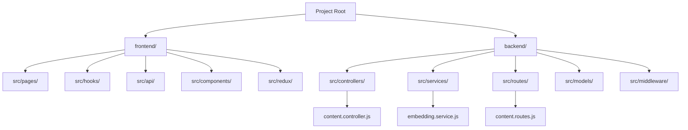
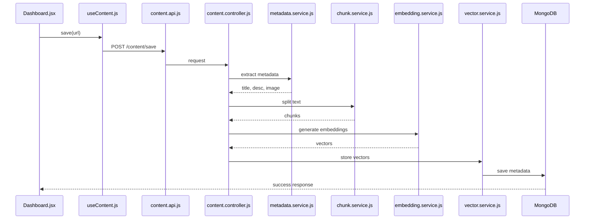
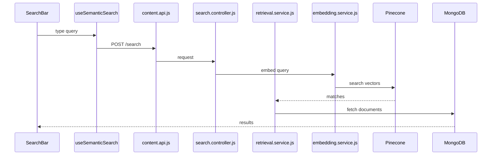
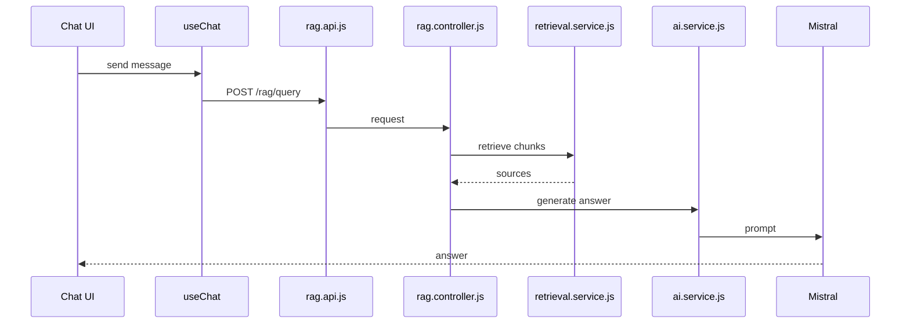
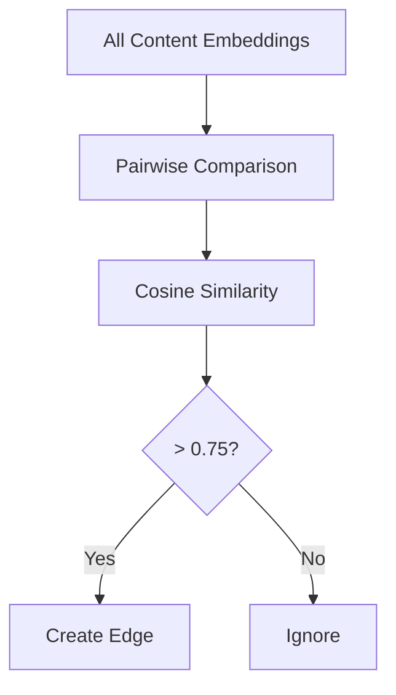
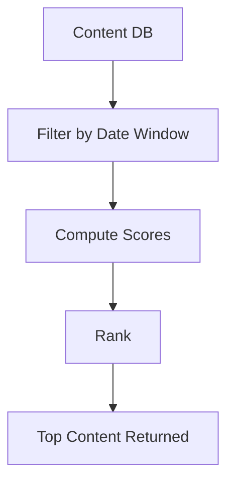
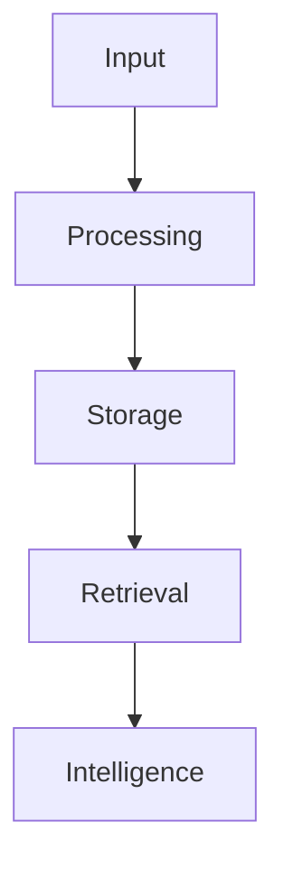

# 🧠 Second Brain App — FULL Detailed Architecture (With Proper Diagrams)

---

# 🔥 1. COMPLETE SYSTEM ARCHITECTURE (Frontend → Backend → Services)

```mermaid
flowchart LR
    subgraph FE[Frontend React App]
        A1[Dashboard.jsx]
        A2[GraphPage.jsx]
        A3[DeepFocus.jsx]
        A4[Auth Pages]
    end

    subgraph HOOKS[Hooks Layer]
        H1[useContent.js]
        H2[useSemanticSearch.js]
        H3[useChat.js]
        H4[useResurfacing.js]
        H5[useAuth.js]
    end

    subgraph API[API Layer]
        API1[content.api.js]
        API2[rag.api.js]
        API3[graph.api.js]
        API4[resurfacing.api.js]
        API5[auth.api.js]
        API6[client.js]
    end

    subgraph BE[Backend Express]
        MW[Auth Middleware]

        subgraph CTRL[Controllers]
            C1[content.controller.js]
            C2[search.controller.js]
            C3[rag.controller.js]
            C4[graph.controller.js]
            C5[resurfacing.controller.js]
            C6[auth.controller.js]
        end

        subgraph SERV[Services]
            S1[metadata.service.js]
            S2[extract.service.js]
            S3[chunk.service.js]
            S4[embedding.service.js]
            S5[vector.service.js]
            S6[ai.service.js]
            S7[aiTagging.service.js]
            S8[retrieval.service.js]
            S9[graph.service.js]
            S10[resurfacing.service.js]
            S11[upload.service.js]
        end
    end

    subgraph EXT[External]
        E1[Mistral AI]
        E2[Pinecone]
        E3[MongoDB]
        E4[ImageKit]
    end

    FE --> HOOKS --> API --> BE
    BE --> CTRL --> SERV
    SERV --> EXT
```



---

# 📂 2. FOLDER + FILE RELATIONSHIP (IMPORTANT)



---

# ⚙️ 3. URL SAVE PIPELINE (DETAILED FLOW)



---

# 🔍 4. SEMANTIC SEARCH FLOW (DETAILED)



---

# 🤖 5. RAG CHAT FLOW (CLEAR + DETAILED)



---

# 🧩 6. KNOWLEDGE GRAPH FLOW



---

# 🔁 7. RESURFACING FLOW



---

# 📦 8. STORAGE FLOW (IMPORTANT)

```mermaid
flowchart LR
    Input --> MongoDB
    Input --> Pinecone

    MongoDB -->|Full Data| UI
    Pinecone -->|Vectors| Search Engine
```

---

# 🔐 9. AUTH FLOW

```mermaid
flowchart TD
    Login --> JWT
    JWT --> Cookie
    Cookie --> Backend Requests
    Backend Requests --> Auth Middleware
```

---

# 🧠 FINAL UNDERSTANDING

This system works like:



---

**Now this version includes:**
✔ File-level diagrams  
✔ Folder structure diagrams  
✔ Pipeline sequence diagrams  
✔ Clear system separation  
✔ Visual explanation of flows  

---

Generated: 2026-03-27
