# 🧠 Second Brain App — System Architecture Blueprint (Clean + Visual)

> Designed for clarity, onboarding, and system reasoning

---

# 🔥 1. SYSTEM OVERVIEW (CLEAN)

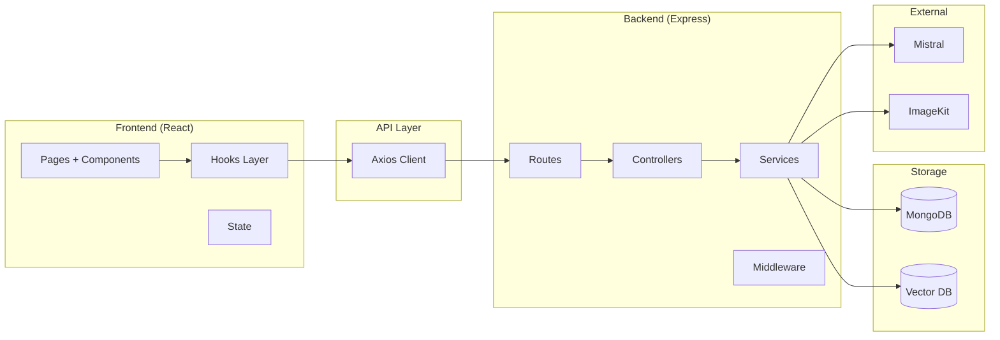

---

# 📂 2. FOLDER STRUCTURE (VISUAL)

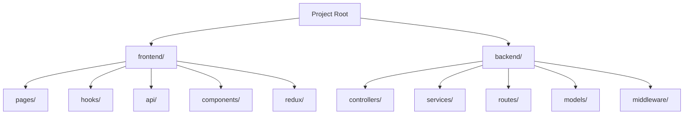

---

# 🧩 3. FILE RESPONSIBILITY FLOW

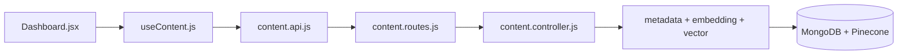

---

# ⚙️ 4. URL SAVE PIPELINE

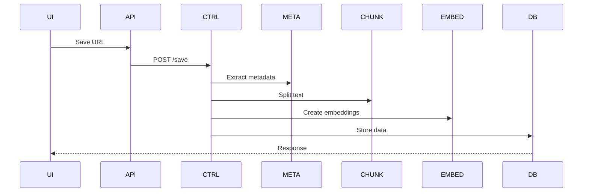

---

# 📄 5. FILE UPLOAD FLOW

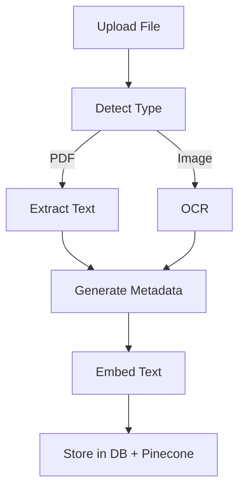

---

# 🔍 6. SEMANTIC SEARCH FLOW

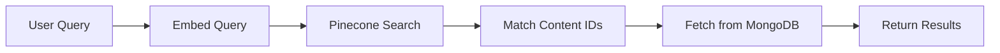

---

# 🤖 7. RAG CHAT FLOW

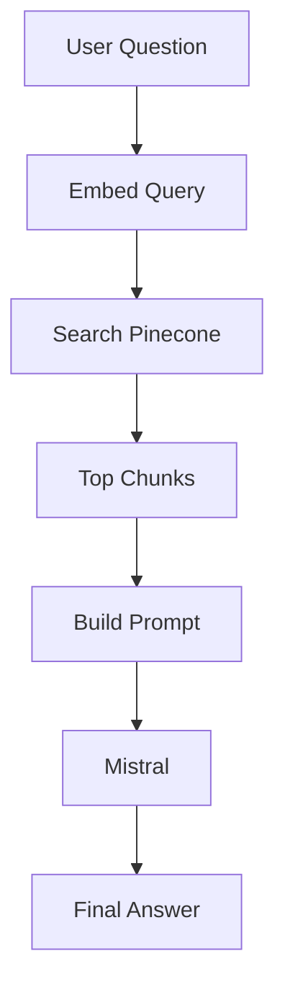

---

# 🧩 8. KNOWLEDGE GRAPH

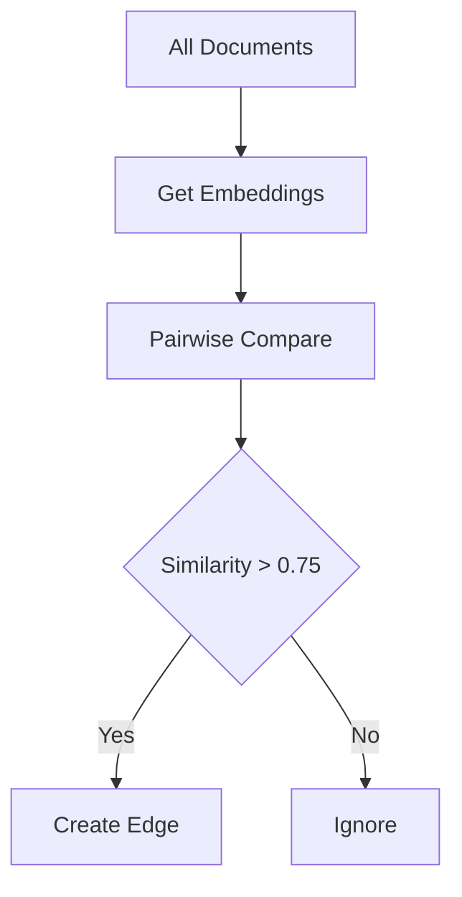

---

# 🔁 9. RESURFACING SYSTEM

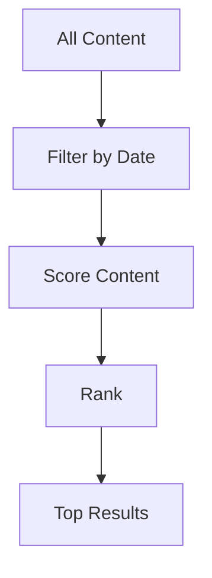

---

# 🔐 10. AUTH FLOW

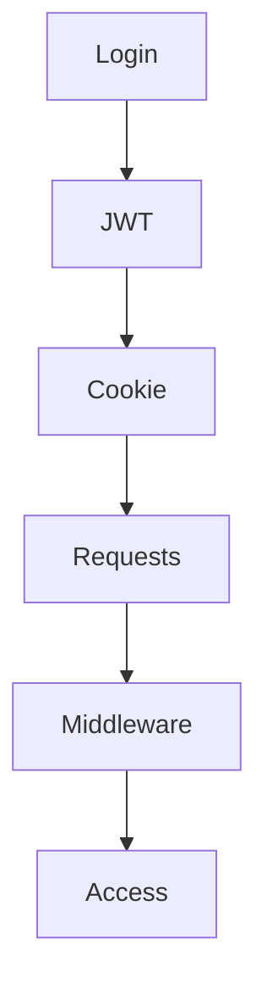

---

# 🔗 11. CONNECTION MAP

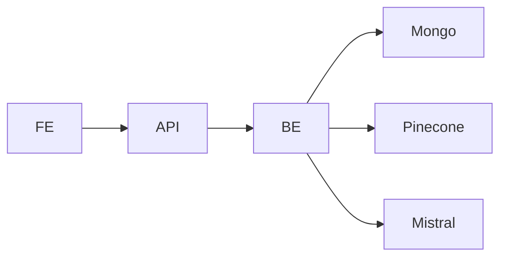

---

Generated: 2026-03-27
